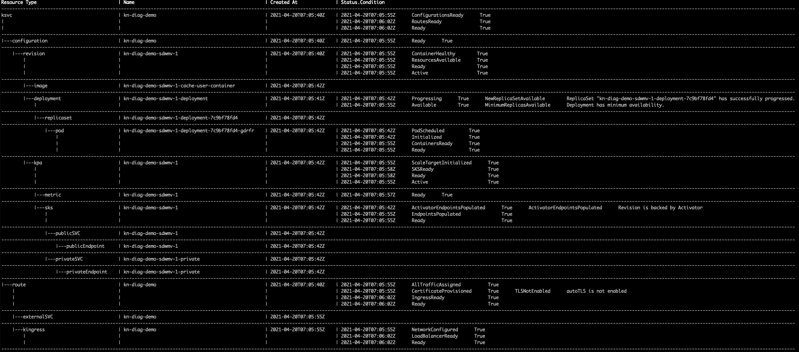
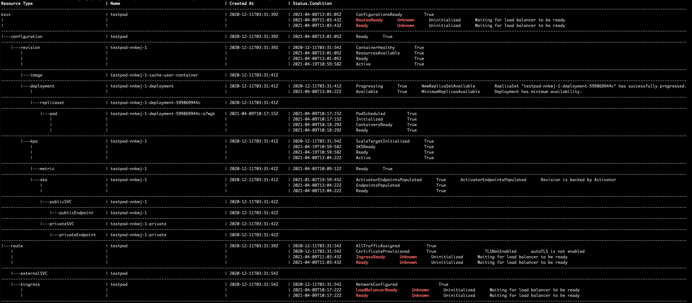
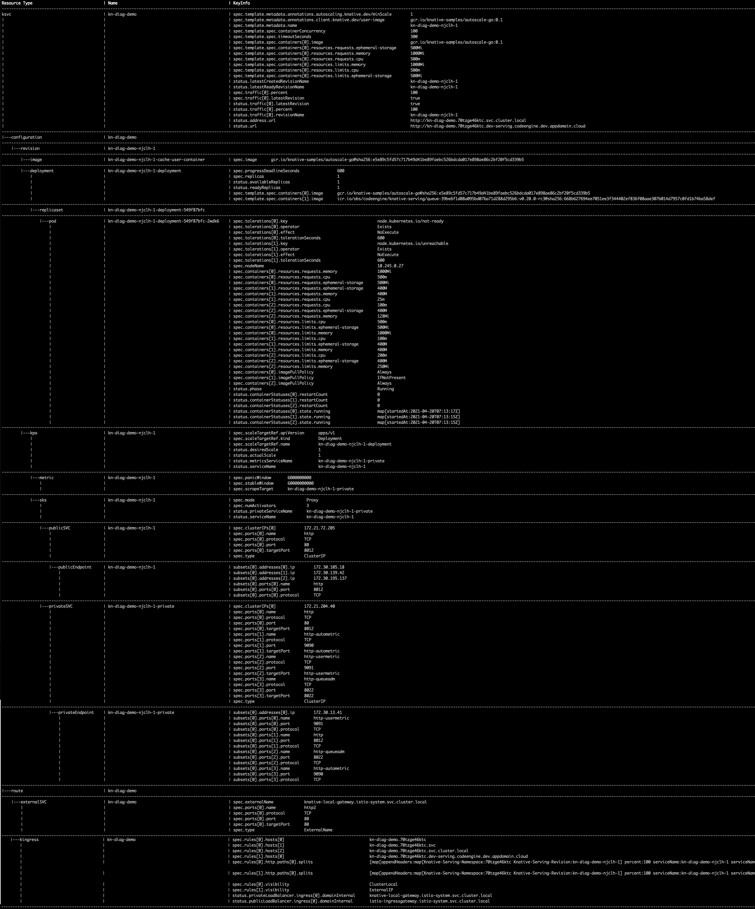

# kn-diag

## Introduction

The `kn-diag` is a plugin of `Knative client`. It is designed to expose information and status of different level of knative resources end-user to facilitate for problem diagnose purpose.

kn-diag is inspired by [Kperf](https://github.com/zhanggbj/kperf) and
[knative inspect](https://github.com/nimakaviani/knative-inspect).

## Installation

You can download latest binaries from the [Releases](https://github.com/knative-sandbox/kn-plugin-diag/releases) page.
Here are two ways to run kn plugin:
* You can run it standalone, just put it on your system path, and make sure it is executable.
* You can install it as a plugin of kn client to run:
   * Following the document to install kn client if you don’t have it.
   * Copy kn-diag binary to ~/.config/kn/plugins/ folder and make sure its filename is kn-diag.
   * Run kn plugin list to assure the kn-diag plugin is installed successfully.
After the plugin is installed, you can use kn plugin to run its related subcommands.


## Usage:

```
$$ kn-diag
A plugin of Knative Client to show detail information of Knative Resources for diagnose purpose.

Usage:
  knative-diagnose [command]

Available Commands:
  help        Help about any command
  service     kantive-diagnose service

Flags:
  -h, --help   help for knative-diagnose

Use "knative-diagnose [command] --help" for more information about a command.

$$ kn-diag service --help

Query knative service details. For example
kn-diag service <ksvc-name>

Usage:
  knative-diagnose service [flags]

Flags:
  -h, --help               help for service
  -n, --namespace string   the target namespace
      --verbose string     enable verbose output. Supported value: keyinfo
```

####  kn-diag service MY-KSVC -n MY-NAMESPACE
This cmd is designed to print differnet Knative service CRs in tree view and show CRs' status.

If knative service works correctly, the output of this cmd looks like below example:


If knative service didn't work as expected, the output of this cmd will expose the error or even highlight parts of the errors (depending on the built-in knowledge in kn-diag source code):



####  kn-diag service MY-KSVC -n MY-NAMESPACE --verbose keyinfo
This cmd is designed to print some known key information of Knative service CRs to facilite debugging.

If knative service works correctly, the output of this cmd looks like below example:



Note: you can short the exposed key info list by managing the [key info list](./pkg/models/keyInfoConfig.go) and build the binary yourself with

```
go build -o kn-diag ./cmd/main.go
```
